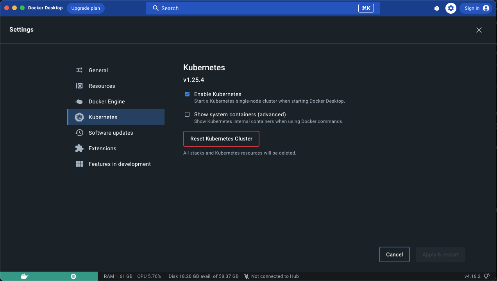

# A tiny demo of the interesting world of K8s

## What is K8s?

Kubernetes is an open-source container orchestration system for automating software deployment, scaling, and management.

But what does that mean? As a non native English speaker, I did understand the above sentence at first. So, let me say it in my words. If you had a few docker containers, you could easily managed them with command lines. If it was a few more, you can utilize docker compose. But what if you had hundreds of docker containers to manage and the relation among them were a mess? In that case you need a container orchestration system, and K8s is one of your choices.

## Concepts

The first concept we need to know is the cluster. A cluster is a set of nodes, that run containerized applications.


As you can see in this image there are a few other concepts which is out of the scope of this demo. However, it is nice to mention their names.

- Api server: Is a component of the Kubernetes control plane that exposes the Kubernetes API.

- etcd: Consistent and highly-available key value store used as Kubernetes' backing store for all cluster data.

- Scheduler: Control plane component that watches for newly created Pods with no assigned node, and selects a node for them to run on.

> All the above components are from the master node. In a real world scenario, the application lives on worker nodes.

Worker nodes are consisted of `kubelet`, `k-proxy` and again, we don't care about them in this demo.

## CKA vs CKAD
Cloud Native Computing Foundation (CNCF) runs two certifications for Kubernetes. 

**Certified K8s Administration (CKA)**, which is self-explanatory and related to the things I mentioned so far.

**Certified K8s Application Development (CKAD)**, which we will have a short demo of it here.


## Setting up a cluster

To do so, all we need for this demo is to install the docker desktop cluster. It is as easy as checking a checkbox in the docker desktop dashboard.



> Note: there are other options like `Kind`, `AKS`, and `EKS` available.


## Creating the demo apps.

I have created to sample apps ([API](./code/demo-api/) and [Client](./code/demo-client/)) but we need to build the docker images. To do so, navigate to the related folders and run the following commands.

API
```
docker build -t k8s-demo-api:v1 .
```
Client
```
docker build -t k8s-demo-client:v1 .
```

## KubeCtl

As we mentioned above, master node exposes an API server which lets us interact with the cluster. Also, there is command line tool (kubectl) which helps use to communicate with the cluster.

Please install it from the [official documentation](https://kubernetes.io/docs/tasks/tools/install-kubectl-linux/).


## Getting to know some commands and concept

### Pods

Pods are the smallest deployable units of computing that you can create and manage in Kubernetes. It could contain one or more containers.

```bash
# To list the running pods
kubectl get pod

# To run a our first pod
kubectl run the-nginx --image nginx

# To delete it
kubectl delete pod the-nginx
```

Let's deploy our API

```bash
# Run to a problem
kubectl run the-api --image k8s-demo-api

kubectl describe pod/the-api

kubectl run the-api --image k8s-demo-api:v1

kubectl get pod
```

Now, lets query it.

```bash
kubectl run the-nginx --image nginx

kubectl get pod -o wide

kubectl exec the-nginx -- curl http://10.1.0.13/WeatherForecast
```

### YAML Fils

The other way to create a resource (pod, service, and etc.) is to create a yaml file and apply it.

```bash
kubectl run api --image k8s-demo-api:v1 --dry-run client -o yaml
```

And the YAML file is

```YAML
apiVersion: v1

kind: Pod

metadata:
  labels:
    run: nginx
  name: nginx

spec:
  containers:
    image: nginx
    name: nginx

    resources: 
      requests:
        memory: "64Mi"
      limits:
        memory: "128Mi"
        cpu: "500m"

    args:
    - /bin/sh
    - -c
    - touch /tmp/healthy; sleep 30; rm -f /tmp/healthy; sleep 600

    livenessProbe:
      exec:
        command:
        - cat
        - /tmp/healthy
      initialDelaySeconds: 5
      periodSeconds: 5

  dnsPolicy: ClusterFirst

  restartPolicy: Always

  tolerations:
  - key: "example-key"
    operator: "Exists"
    effect: "NoSchedule"
```

Apply from files:

```bash
kubectl apply -f ./yamls/api.yaml
kubectl delete -f ./yamls/api.yaml
```

### Scale up vs Scale out

```bash
kubectl apply -f ./yamls/deployment-api.yaml 
kubectl apply -f ./yamls/deployment-client.yaml 

# Edit or scale
kubectl scale --replicas=1 deployment/client-deployment
```

### Service

```bash
kubectl apply -f ./yamls/service-api.yaml 
kubectl apply -f ./yamls/service-client.yaml 

kubectl exec the-nginx -- curl http://api-service.default.svc.cluster.local/WeatherForecast
```

### Ingress

First install controller.

```bash
kubectl apply -f https://raw.githubusercontent.com/kubernetes/ingress-nginx/controller-v1.6.4/deploy/static/provider/cloud/deploy.yaml

# Then create the ingress
kubectl apply -f ./yamls/ingress.yaml
```

### Let's upgrade

First build the v2 of the API.

```bash
kubectl set image deployment/api-deployment api=k8s-demo-api:v2
```

### Config the environment 

```bash
kubectl create configmap api-config --from-literal=ANY_NAME=7
kubectl rollout restart deployment/api-deployment
```

Add the following to yaml
```bash
        env:
          - name: DAYS_IN_FUTURE
            valueFrom:
              configMapKeyRef:
                name: api-config
                key: ANY_NAME
```

> Let experiment changing a config and killing only one pod!

### Watch out

```bash
kubectl run the-random-pod --image k8s-demo-client:v2 
kubectl label pod the-random-pod app=client
```
